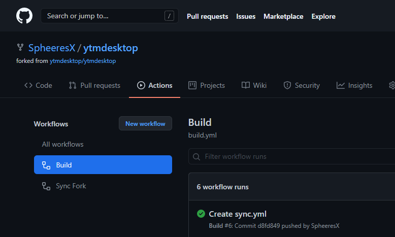
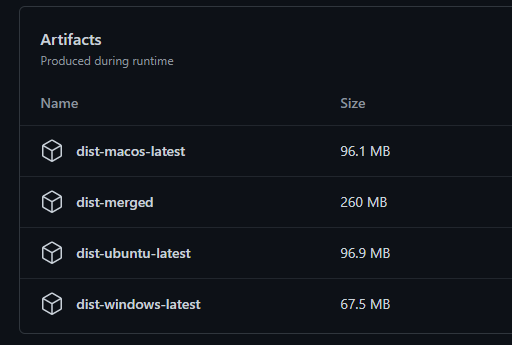

# YouTube Music Desktop App


&nbsp;

This is a fork of `ytmdesktop/ytmdesktop` with **ad blocking** and **no 3rd-party analytics**.

## Downloads

**1. Go to the Actions tab of this repository, and select the "Build" workflow.**



**2. Click on the first item that has a green check mark, and scroll down to Artifacts. Click on the one that matches your OS.**



## Contributing

To clone and run this repository you'll need [Git](https://git-scm.com) and [Node.js](https://nodejs.org/en/download/) (which comes with [npm](http://npmjs.com)) installed on your computer. From your command line:

```bash
# Clone this repository
git clone https://github.com/ytmdesktop/ytmdesktop
# Go into the repository
cd ytmdesktop
# Install dependencies
npm install
# Run the app
npm start
```

Note: If you're using Linux Bash for Windows, [see this guide](https://www.howtogeek.com/261575/how-to-run-graphical-linux-desktop-applications-from-windows-10s-bash-shell/) or use `node` from the command prompt.